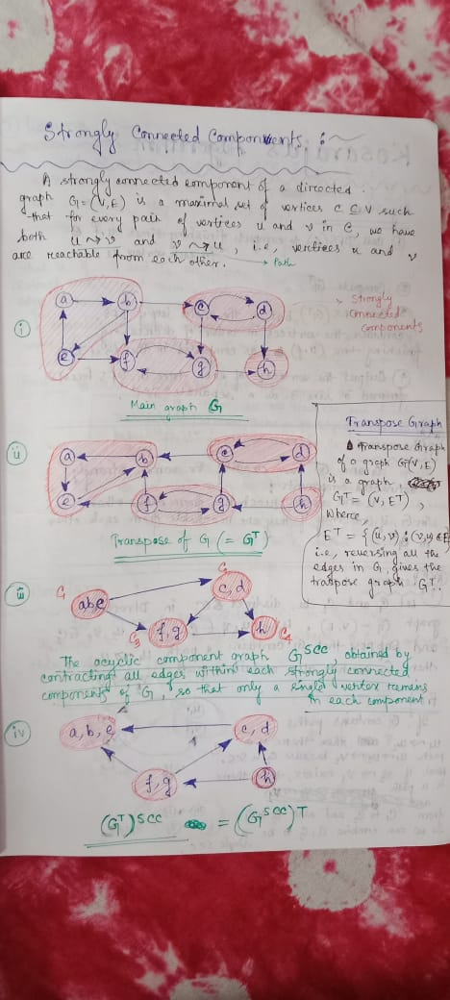

# Application:
- ### Lexicographically smallest path:
  - DFS can used to find the lexicographically smallest path from source to dest node. While visiting neighbors of each node u, just process in lexicographical order.
- ### Check if a is ancestor of b in Tree: (Balanced Parenthesization property of DFS) 
  - #### Given a ***Tree*** and ***Root***
  - #### Query: given 2 nodes a and b, check if a is ancestor of b in O(1) time
  - Solution is: preprocess the graph: Run DFS from the root node
  - Calculate `startTime[u]` and `finishTime[u]` for each node
  - In a tree, if we do DFS from root, vertex a is ancestor of vertex b, ***if and only if***:
    - `startTime[a] < starTime[b] < finishTime[b] < finishTime[a]`
      
- ### Find bridges in an undirected graph: [TODO]
  - First convert the given graph into a directed graph by running a series of depth first searches and making each edge directed as we go through it, in the direction we went.
  - Second, find the strongly connected components in this directed graph.
  - Bridges are the edges whose ends belong to different strongly connected components

- ### Mother vertex: [directed graph]
  - Definition: a vertex from which you can visit all vertices of the graph
  - In the Strongly_Connected_Component_Graph of the given graph, the nodes in the component with no incoming edge, are the mother vertices of that graph.
  - Here a, b, e are mother vertices.
  - 
  - Similar to Kosaraju's algo: if we do DFS and then the node with the last finish time will be one of the nodes from that strongly connected component.
  - All those vertices in that component are mother vertices, so in the transpose graph from that node if we do DFS then only and all mother vertices will be visited. Thank you.
  - To find a single mother vertex, do DFS from that last finsh time node and check whether all nodes can be visited. If yes then that is a mother vertex. If no then, no mother vertex exists for that graph. 
